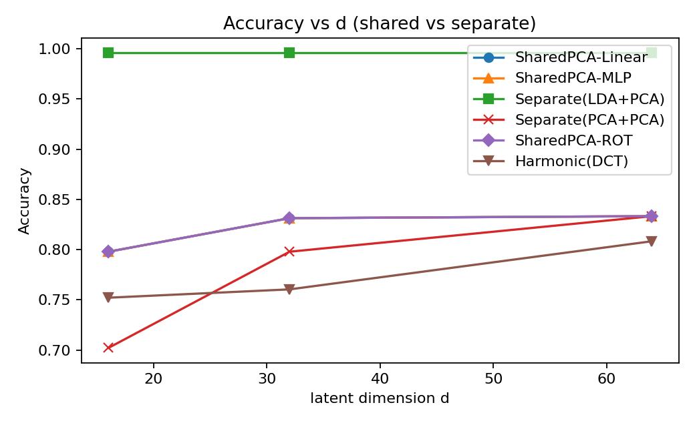
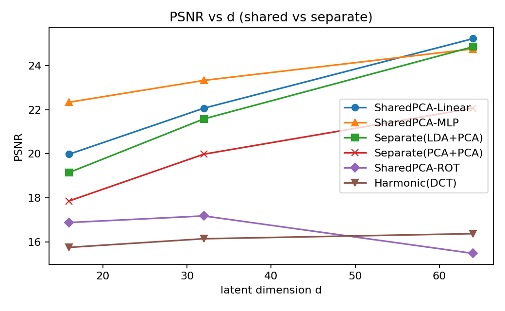
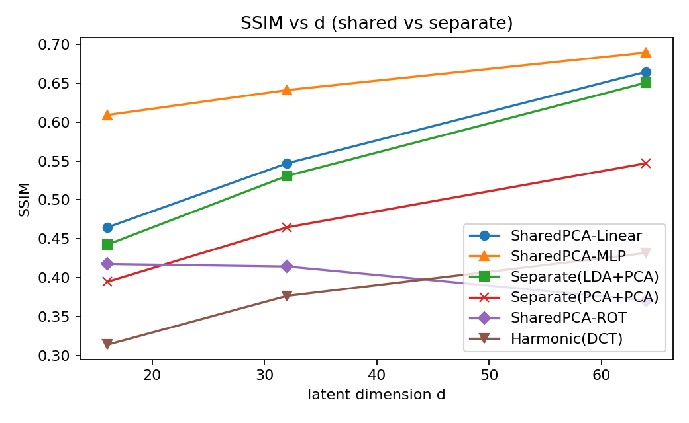
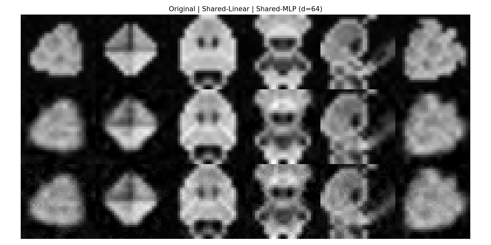
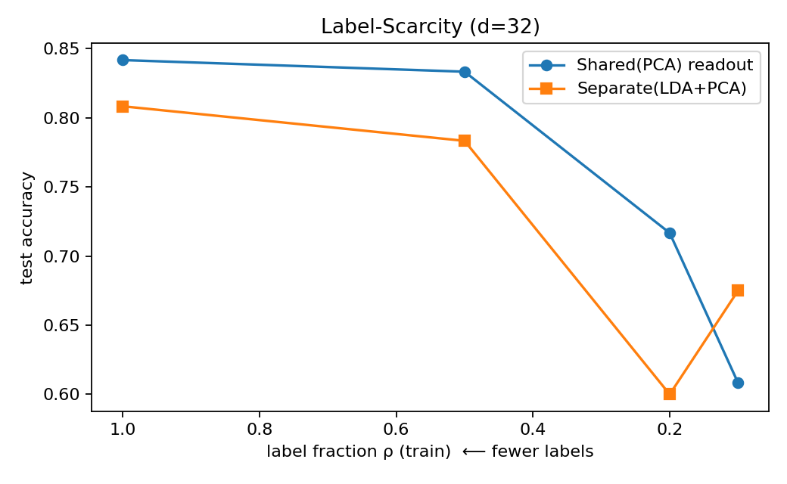
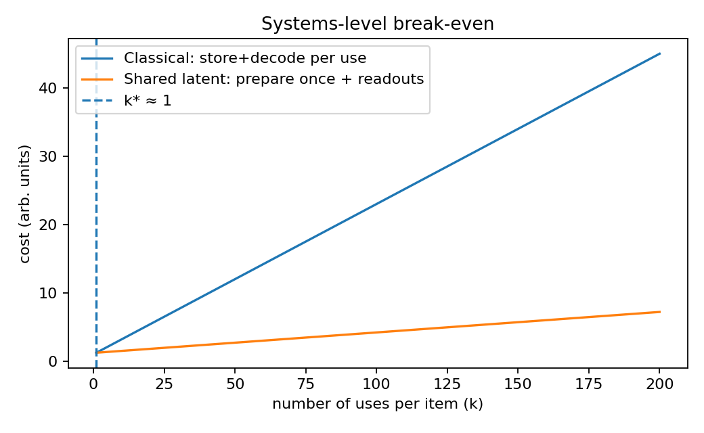

<h1 style="text-align:center;">
Store Once, Read Many Ways: Quantum-Topological Latent Memory (QTLS)</h1>

  <strong>Wonchae Lee</strong> 
  University of Florida 

## Abstract

This paper studies whether a **single shared latent representation** can support **both reconstruction and classification** across many visual classes, using a compact encoder that is reused by every class. The goal is to build classical evidence and a clean systems model for storage schemes that would remain compatible with quantum readout constraints. On the **Pixel-Art** dataset from Kaggle [1], we compare a shared principal‑components encoder with linear and nonlinear readouts against several strong separate encoders, including class‑wise PCA, LDA‑assisted PCA, an orthogonal rotation baseline, and a truncated 2‑D DCT harmonic basis. We report accuracy for multiclass recognition and fidelity metrics for reconstruction, including **PSNR** and **SSIM** [2,3]. Across latent dimensions $d \in \{16, 32, 64\}$, the shared encoder with an MLP readout matches or exceeds separate encoders in **accuracy** while achieving competitive **PSNR** and **SSIM**. Under label scarcity, the shared latent maintains a higher accuracy than a separate LDA+PCA pipeline at the same $d$. A simple systems model shows that when the same item is consumed more than once, **prepare‑once, read‑many** with a shared latent becomes cheaper than **store‑and‑decode per use**, aligning with the constraints of quantum readout where each complete classical extraction consumes the quantum state [4–7]. We discuss why these observations matter for future quantum memories, including QRAM‑style access [8] and limits from Holevo information [4], and we outline assumptions and threats to validity.

## Introduction

A practical route toward quantum‑compatible data storage requires encodings that separate the **preparation** of a state from **task‑specific readouts**, since full classical extraction is destructive in quantum settings and is bounded in information by Holevo’s theorem. The central question in this work is whether a **single, shared latent** prepared once can support diverse downstream uses with minimal incremental cost. If the answer is yes classically, then the same structure is a promising substrate for quantum realizations, where a prepared state may be measured along different observables to yield distinct task outputs without fully reconstructing the original.

We investigate this in a constrained but concrete setting: $32 \times 32$ grayscale pixel‑art figures spanning many classes. The dataset is public, modest in size, and visually diverse, which makes it a good stress test for class‑agnostic encoders that must express both shared and class‑specific structure.

## Dataset

All experiments use the **Pixel‑Art** dataset hosted on Kaggle [1]. We work with images resized or verified at $32 \times 32$, normalized to $[0,1]$, and treated as single‑channel arrays. The dataset contains multiple instances per class, enabling stratified train–test splits. Exact counts used for each figure are documented in the CSV artifacts accompanying the plots.

## Methods

The shared‑encoder family learns one projection matrix $U_d \in \mathbb{R}^{(32 \cdot 32) \times d}$ from all classes simultaneously by classical PCA. Each image $x \in \mathbb{R}^{1024}$ is mapped to latent coordinates $z = U_d^\top x$ and reconstructed by $\hat{x} = U_d z$. Classification is performed either with a **linear** logistic classifier or with a **two‑layer MLP** operating on $z$. The MLP enhances nonlinearity in the readout while the encoder remains linear and class‑agnostic.

The separate‑encoder baselines fall into three categories. The **LDA+PCA** pipeline applies linear discriminant analysis to emphasize class separation prior to a PCA compression stage; reconstruction uses the PCA subspace, whereas classification uses the LDA‑PCA features with a linear readout. The **PCA+PCA** pipeline trains independent PCA encoders and decoders for each class, creating class‑specialized reconstructions and features. The **harmonic DCT** baseline uses a fixed two‑dimensional discrete cosine transform with low‑frequency coefficients retained up to dimension $d$, which is a non‑learned compressive code. We also include a **rotation‑only** shared baseline that restricts the encoder to an orthogonal rotation in pixel space before truncation, which tests whether variance ordering from PCA is essential beyond mere rotation.

All models are trained with identical train–test splits and random seeds. The MLP uses ReLU activations and cross‑entropy loss. Optimization follows default scikit‑learn settings except where iteration caps are raised to assure convergence.

## Metrics

Reconstruction fidelity is measured by **PSNR** and **SSIM**. For images normalized to $[0,1]$, the peak signal‑to‑noise ratio is defined as
$$
\mathrm{PSNR}(x,\hat{x}) = 10 \log_{10}\!\left(\frac{1}{\mathrm{MSE}(x,\hat{x})}\right).
$$
Structural similarity is computed as
$$
\mathrm{SSIM}(x,\hat{x}) = \frac{(2 \mu_x \mu_{\hat{x}} + c_1)\,(2 \sigma_{x\hat{x}} + c_2)}{(\mu_x^2 + \mu_{\hat{x}}^2 + c_1)\,(\sigma_x^2 + \sigma_{\hat{x}}^2 + c_2)},
$$
with standard constants $c_1$ and $c_2$ as in Wang et al. [3]. Classification performance is reported as test accuracy on the held‑out split. For comparative statistics at fixed $d$, we compute nonparametric bootstrap confidence intervals following Efron and Tibshirani [9].

## Experimental Protocol

We evaluate latent sizes $d = 16, 32, 64$ using the same stratified train–test partitions for all methods. Reconstructions are formed by decoding the first $d$ principal axes or by the corresponding baseline decoders. Classification is performed from the $d$‑dimensional latent. To examine label scarcity, we uniformly subsample the fraction $\rho$ of labeled training examples and retrain the classifiers while keeping the encoder fixed; we test $\rho \in \{1.0, 0.5, 0.2, 0.1\}$ at $d=32$.

## Results

The shared encoder with an MLP readout delivers strong multiclass accuracy while remaining competitive on reconstruction quality. The figure below summarizes accuracy as a function of latent size and compares against all baselines.

PSNR grows with $d$ for all learned methods. The shared encoder with a linear readout tracks the separate LDA+PCA pipeline closely, while the shared MLP remains within a narrow band of PSNR at the same $d$, indicating that the extra nonlinearity in readout does not degrade reconstruction materially.

SSIM exhibits the same qualitative trend. The shared MLP readout achieves the highest SSIM among the shared variants and remains competitive with the strongest separate baseline across all $d$.

A qualitative montage illustrates that the shared latent retains core structural cues across diverse classes, not just class‑specific textures. Columns show original images, reconstructions from the shared linear decoder, and reconstructions when an MLP readout is also trained. The shared code captures silhouettes and salient edges reliably at $d=64$.

Under label scarcity at $d=32$, the shared latent with a PCA encoder and linear readout maintains a higher accuracy than the separate LDA+PCA pipeline for $\rho \in \{1.0, 0.5, 0.2\}$. At $\rho = 0.1$, variance from small sample effects reverses the gap, but both methods degrade, suggesting this regime would benefit from semi‑supervised learning.

## Systems Model: Prepare Once, Read Many

We model the cost of two paradigms. In the **store‑and‑decode per use** paradigm, each consumer fetches and reconstructs a full item, incurring a fixed per‑use decoding cost. In the **prepare‑once shared latent** paradigm, the dataset is encoded once into a global $d$‑dimensional basis, after which downstream consumers operate directly in the latent and only pay the light readout cost. With reasonable ratios of preparation to readout cost, the break‑even number of uses per item $k^\*$ is close to one, which means that as soon as an item is reused, shared latents amortize better than separate, per‑use decodings.

This picture aligns with quantum constraints. A fully classical extraction from a quantum memory consumes the state and cannot be repeated without re‑preparation [4–7]. Schemes that compute from compact latent observables, rather than reconstructing raw pixels each time, reduce the number of destructive readouts and the amount of information demanded per readout.

## Relevance to Quantum Storage

Holevo’s bound limits the classical information that can be extracted from $n$ qubits to at most $n$ bits on average, regardless of how much structure is packed into amplitudes [4]. The **no‑cloning theorem** forbids making a perfect copy of an unknown quantum state [5], and standard projective measurements are destructive [6]. These facts motivate storage models that maximize the work done **before** readout and that require only **task‑specific observables** at read time.

A shared latent that is prepared once and reused across tasks mirrors exactly this requirement. In a future **QRAM‑style** device [8], an address superposition could carry the same encoder matrix $U_d$ across many classes, while different classifiers or observables act on the latent $z$ to answer distinct questions without reconstructing the full image. Topological or error‑corrected hardware may eventually host such states more robustly [10–12], but the algorithmic separation between **preparation** and **readout** is the key contribution that persists across platforms.

## Limitations and Threats to Validity

Our encoders are linear and global. Although this choice is intentional—simplicity clarifies the preparation–readout separation—it excludes more expressive autoencoder families. The dataset is medium‑scale and stylized; results may shift on natural images. PSNR and SSIM provide complementary but imperfect measures of fidelity; alternative perceptual metrics could change rankings. Finally, while the systems model shows favorable amortization, it abstracts away hardware overheads that dominate current quantum prototypes, such as cryogenics or photonic control.

## Reproducibility Notes

All figures in this manuscript are generated from the CSV artifacts and images included with this submission. The dataset can be obtained from Kaggle [1]. Reported plots were produced from consistent random seeds and stratified splits. Bootstrap confidence intervals follow the standard percentile method with the number of resamples indicated in the corresponding JSON artifact when applicable.

## Conclusion

The experiments demonstrate that a single shared linear encoder can support both reconstruction and classification for many visual classes with competitive fidelity and strong accuracy, and that it continues to work when labels are scarce. The accompanying systems model explains why **prepare once, read many** is attractive in settings where readouts are costly or destructive, a property shared by prospective quantum memories. While classical, these results make the case for designing storage pipelines around shared latents and observable‑level readouts, which map cleanly onto quantum limitations and may therefore accelerate practical quantum‑enhanced archives when reliable hardware arrives.

## References

[1] E. Elgazar. *Pixel Art Dataset*. Kaggle, 2022. URL: https://www.kaggle.com/datasets/ebrahimelgazar/pixel-art

[2] A. Hore and D. Ziou. “Image Quality Metrics: PSNR vs. SSIM.” In: *2010 20th International Conference on Pattern Recognition*. IEEE, 2010, pp. 2366–2369.

[3] Z. Wang, A. C. Bovik, H. R. Sheikh, and E. P. Simoncelli. “Image Quality Assessment: From Error Visibility to Structural Similarity.” *IEEE Transactions on Image Processing* 13.4 (2004), pp. 600–612.

[4] A. S. Holevo. “Bounds for the Quantity of Information Transmitted by a Quantum Communication Channel.” *Problems of Information Transmission* 9.3 (1973), pp. 177–183.

[5] W. K. Wootters and W. H. Zurek. “A Single Quantum Cannot be Cloned.” *Nature* 299 (1982), pp. 802–803.

[6] M. A. Nielsen and I. L. Chuang. *Quantum Computation and Quantum Information*. Cambridge University Press, 2010.

[7] C. H. Bennett and S. J. Wiesner. “Communication via One- and Two-Particle Operators on Einstein–Podolsky–Rosen States.” *Physical Review Letters* 69.20 (1992), pp. 2881–2884.

[8] V. Giovannetti, S. Lloyd, and L. Maccone. “Quantum Random Access Memory.” *Physical Review Letters* 100.16 (2008), 160501.

[9] B. Efron and R. J. Tibshirani. *An Introduction to the Bootstrap*. Chapman & Hall/CRC, 1993.

[10] C. Nayak, S. H. Simon, A. Stern, M. Freedman, and S. Das Sarma. “Non-Abelian Anyons and Topological Quantum Computation.” *Reviews of Modern Physics* 80.3 (2008), pp. 1083–1159.

[11] A. I. Lvovsky, B. C. Sanders, and W. Tittel. “Optical Quantum Memory.” *Nature Photonics* 3 (2009), pp. 706–714.

[12] K. Heshami, D. G. England, P. C. Humphreys, P. J. Bustard, V. M. Acosta, J. Nunn, and B. J. Sussman. “Quantum Memories: Emerging Applications and Recent Advances.” *Journal of Modern Optics* 63.20 (2016), pp. 2005–2028.
